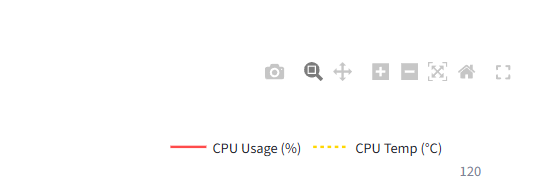
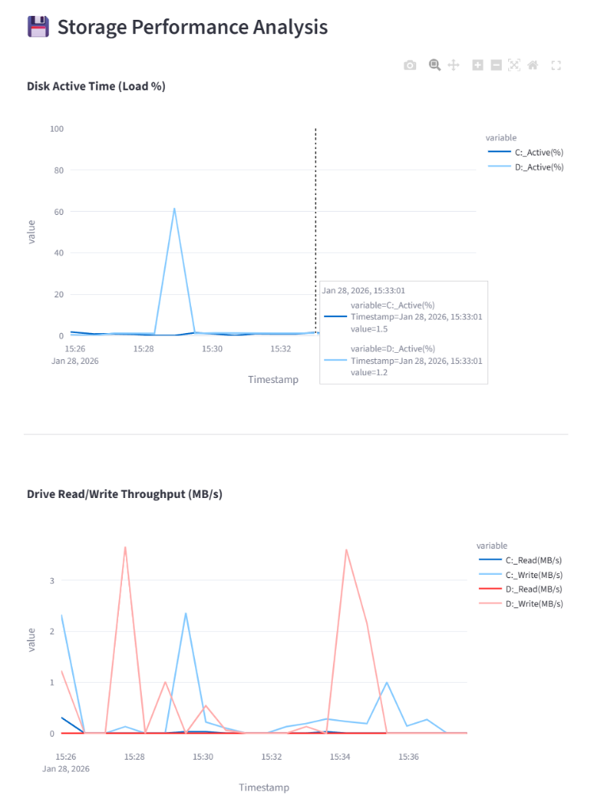
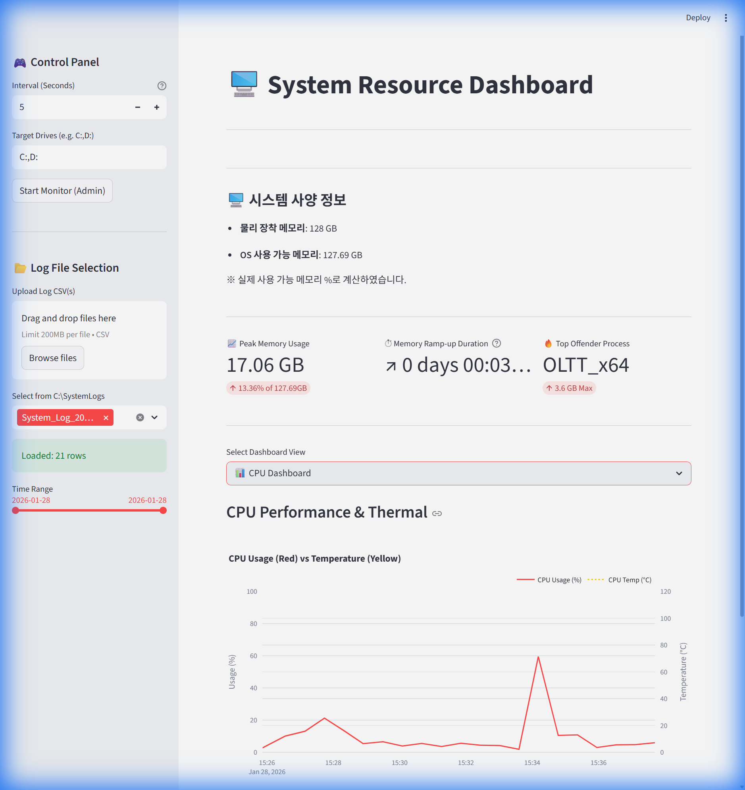
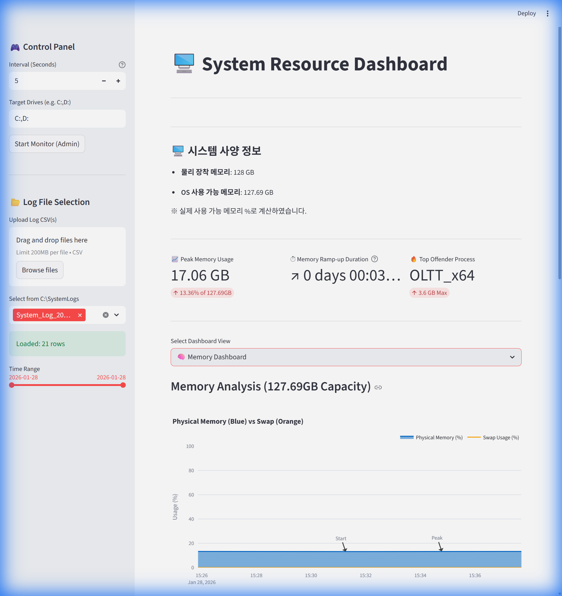
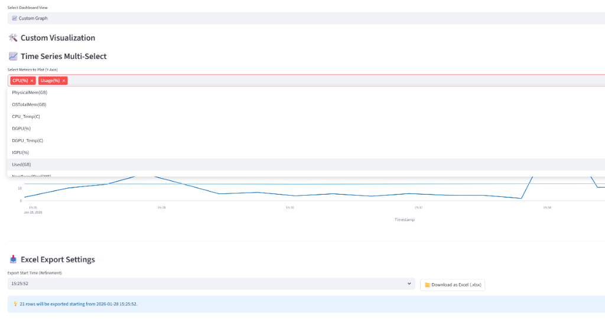

# User Manual

Updated On: 2026-03-31  
Status: Active

이 문서는 현재 Streamlit 대시보드와 수집기 사용 방법을 설명합니다.

## 프로그램 시작

### 수집 시작

1. 관리자 권한으로 `start_monitor.bat`를 실행하거나 대시보드의 `Start Monitor` 버튼을 사용합니다.
2. 수집이 시작되면 `C:\SystemLogs`에 로그가 저장됩니다.
3. 종료하려면 콘솔 창에서 `Ctrl + C`를 누르거나 창을 닫습니다.

기록되는 주요 파일:

- `resource_YYYYMMDD.csv`
- `process_YYYYMMDD.csv`
- `summary_YYYYMMDD.log`

### 대시보드 실행

- 개발 환경: `.\venv\Scripts\python -m streamlit run app.py`
- 패키징 환경: `SystemResourceMonitor*.exe`

## 화면 구성

### Control Panel

- `Start Monitor`: 관리자 권한으로 수집기 실행
- `Refresh Log Data`: Streamlit 캐시를 비우고 최신 로그 반영
- 안내 문구: Python Collector는 1초 샘플링, 5초 집계 기준으로 동작

### Log File Selection

- `Upload Log CSV(s)`: 시스템 모니터 CSV를 직접 업로드
- `Select Record Date from C:\SystemLogs`: 날짜별 로그 묶음 선택
- 기본 동작: 최근 7일 이내 로그를 자동 선택
- `Time Range`: 로드된 데이터 범위를 슬라이더로 빠르게 조정
- `Start Time`, `End Time`: 시작/종료 시각을 직접 입력하는 수동 필터

지원 입력 형식:

- `YYYY-MM-DD HH:MM:SS`
- `YYYY-MM-DD HH:MM`
- `YYYY-MM-DD`
- `HH:MM`
- `HH:MM:SS`

수동 필터 동작 규칙:

- `Start Time`만 입력하면 입력 시각부터 로그 끝까지 표시합니다.
- `End Time`만 입력하면 로그 시작부터 입력 시각까지 표시합니다.
- `Start Time`과 `End Time`을 모두 입력하면 해당 범위만 표시합니다.
- 입력한 시각과 정확히 일치하는 샘플이 없으면 `Start Time`은 그 이후 첫 샘플, `End Time`은 그 이전 마지막 샘플로 자동 보정합니다.
- 여러 날짜를 함께 불러온 상태에서 시간만 입력하면 `Start Time`은 첫 로드 날짜, `End Time`은 마지막 로드 날짜를 기준으로 해석합니다. 여러 날짜를 좁게 지정하려면 전체 날짜/시간을 함께 입력합니다.
- `Start Time`과 `End Time`을 모두 비우면 다시 슬라이더 기준으로 동작합니다.

### AOI / Inspector Log

- `Upload AOI / Inspector Log(s)`에서 `Browse files`를 눌러 TXT 또는 LOG 파일을 직접 선택할 수 있습니다.
- 개발자가 아닌 블랙박스 테스터도 파일 탐색기에서 바로 선택해 사용할 수 있습니다.
- 원본 TXT / LOG는 수정하지 않고, 필요한 `InspTime` / `Working Set Memory Size` 라인만 읽어 별도 시계열로 정리합니다.
- 필요할 때만 `Advanced: Load AOI / Inspector Log by Path`를 열어 경로 입력 방식을 사용할 수 있습니다.
- 예시 경로: `C:\Inspector\shared\operation_0319_north side grab`

## 대시보드 화면

- `CPU Dashboard`
- `Memory AND Inspector Dashboard`
- `Storage Dashboard`
- `Custom Graph`

그래프 오른쪽 상단 도구 모음에서 확대, 이동, 리셋, 이미지 저장을 사용할 수 있습니다.

## Storage Dashboard

스토리지 화면은 데이터 크기에 따라 차트 밀도를 조절할 수 있습니다.

- `Fast`
- `Balanced`
- `Detailed`
- `Original (slow)`

권장 사용 순서:

1. `Balanced`로 전체 추세 확인
2. 필요한 구간만 `Detailed`로 확대
3. 최종 검증만 `Original (slow)` 사용

## CPU 와 Memory Dashboard

### CPU

- CPU 평균/피크 사용량 확인
- CPU 온도 시계열 확인
- 요약 KPI 확인

### Memory

- 메모리 사용량과 스왑 사용량 확인
- 상위 메모리 프로세스 확인
- `Inspector APP (log)` Working Set 메모리 비교
- Inspector `Frame`, `Total`, `Working Set` 시계열 확인
- 외부 시스템 모니터 메모리와 AOI 로그 메모리 비교

## Custom Graph 와 데이터 내보내기

1. 필요한 수치 컬럼을 선택합니다.
2. 필요 시 `Time Range` 또는 수동 시작/종료 시각을 조정합니다.
3. `Download as Excel (.xlsx)` 또는 병합 CSV 다운로드를 사용합니다.

## 문제 해결

### 로그가 보이지 않을 때

- `C:\SystemLogs`가 존재하는지 확인합니다.
- 관리자 권한으로 수집기를 실행했는지 확인합니다.
- `Refresh Log Data`로 캐시를 비웁니다.
- AOI 로그는 `Upload AOI / Inspector Log(s)`에서 파일을 다시 선택합니다.

### 그래프가 예상과 다를 때

- `Storage Dashboard`에서는 `Fast` 또는 `Balanced`를 먼저 사용합니다.
- `Time Range` 슬라이더를 확인합니다.
- 수동 입력이 남아 있으면 `Start Time`, `End Time`을 비워 슬라이더 제어로 되돌립니다.

### 메뉴얼 페이지가 열리지 않을 때

- 대시보드의 `매뉴얼 열기 (MkDocs)` 버튼을 사용하면 패키징된 `site/index.html`이 열립니다.
