# User Manual

Updated On: 2026-07-06
Status: Active

이 문서는 현재 Streamlit 대시보드와 수집기 사용 방법을 설명합니다. 사용자 화면 기준 명칭은 한국어 UI에 맞춰 표기합니다.

## 프로그램 시작

### 대시보드 실행

1. 배포 폴더에서 `SystemResourceMonitor*.exe`를 실행합니다.
2. 브라우저가 열리면 좌측 `제어판`과 본문 `시스템 자원 대시보드` 제목이 함께 보이는지 먼저 확인합니다.
3. 첫 화면이 보이면 아직 수집을 시작하지 않은 상태여도 정상입니다. 기존 로그가 있으면 일부 카드나 그래프가 바로 채워질 수 있습니다.

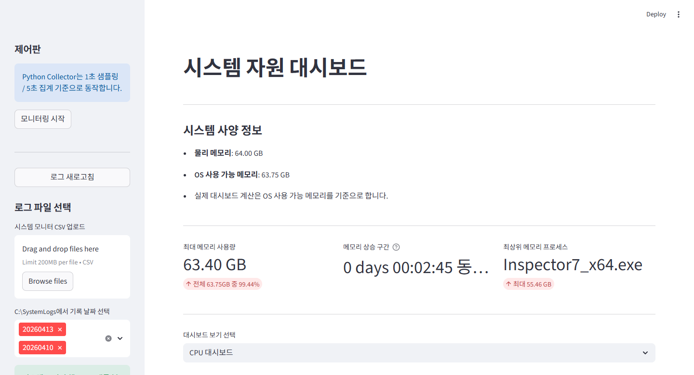

1. 왼쪽 `제어판`에서 수집 시작과 로그 새로고침을 제어합니다.
2. 가운데 큰 제목 `시스템 자원 대시보드`가 현재 메인 진입 화면입니다.
3. 아래 `로그 파일 선택` 영역에서 기존 CSV 로그를 불러와 분석만 먼저 할 수도 있습니다.

실무 기준 진입 경로는 EXE입니다. 개발 환경 확인이 필요할 때만 `.\venv\Scripts\python -m streamlit run app.py`를 사용합니다.

### 수집 시작

1. 첫 화면 왼쪽 `제어판`에서 `모니터링 시작`을 누릅니다.
2. 버튼을 누르면 Windows 관리자 권한 허용 창이 뜰 수 있습니다. 허용 뒤 초록색 성공 메시지와 파란 안내 메시지가 보이면 UI 기준으로는 정상 시작입니다.
3. 수집이 시작되면 `C:\SystemLogs`에 로그가 저장됩니다.
4. 종료하려면 열려 있는 콘솔 창에서 `Ctrl + C`를 누르거나 창을 닫습니다.

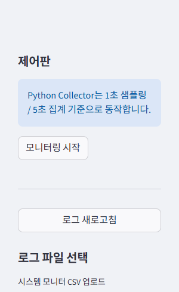

1. `모니터링 시작`은 좌측 `제어판` 상단에 있습니다.
2. 바로 아래 `로그 새로고침`은 분석 화면 캐시만 비우는 버튼이므로, 수집 시작 버튼과 혼동하지 않도록 구분합니다.
3. 수집 전에는 성공 메시지가 없고, 버튼만 보이는 상태가 정상입니다.

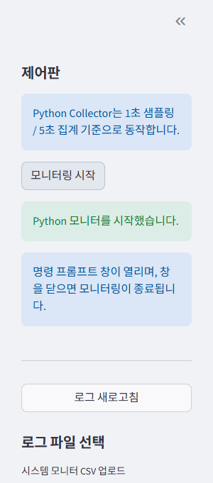

1. `Python 모니터를 시작했습니다.`가 보이면 Streamlit 앱이 수집기 실행 요청을 보낸 상태입니다.
2. `명령 프롬프트 창이 열리며...` 안내가 보이면 종료 방법까지 정상 표시된 것입니다.
3. 이 장면은 웹 UI 기준 확인 화면입니다. Windows UAC, 탐색기, 관리자 권한 팝업 같은 네이티브 창은 매뉴얼 스크린샷 대상이 아닙니다.

버튼을 눌렀는데 성공 메시지가 전혀 안 보이면 가장 먼저 관리자 권한 허용 창이 뒤로 가려지지 않았는지 확인합니다.
버튼은 PowerShell을 실행하지 않고 Windows 관리자 권한 실행 API를 직접 사용합니다. 따라서 PowerShell이 손상된 PC에서도 버튼 경로는 계속 시도할 수 있습니다.
그래도 `액세스가 거부되었습니다`가 나오면 EXE 파일 차단 해제, Windows Defender/SmartScreen, AppLocker/WDAC 같은 보안 정책, 현재 계정의 로컬 관리자 권한을 먼저 확인합니다.
UI 대신 직접 시작해야 할 때만 관리자 권한으로 `start_monitor.bat`를 실행하는 대체 경로를 사용합니다.

기록되는 주요 파일:

- `resource_YYYYMMDD.csv`
- `process_YYYYMMDD.csv`
- `summary_YYYYMMDD.log`

CPU 온도 센서가 현재 시스템에서 잡히는지 빠르게 확인하려면 `.\venv\Scripts\python cli.py probe-temp`를 실행할 수 있습니다.
Dell Precision T5/T7 Tower 계열 제어 PC에서는 `probe-temp`와 `start`가 먼저 Dell Command | Monitor 설치 상태를 확인하고, 필요하면 공식 Dell 패키지를 자동으로 내려받아 무인 설치합니다.
일반 PC이거나 Dell 대상 모델이 아니면 EXE에 함께 들어 있는 `lhm-bundle`을 먼저 사용하고, 그 안의 `LibreHardwareMonitorLib.dll`을 `pythonnet`으로 읽어 30초마다 `CPU Core #n` 최고온도를 갱신합니다.
LibreHardwareMonitor 0.9.6 계열에서는 CPU 코어 센서가 PawnIO 드라이버에 의존할 수 있습니다. 배포본에는 `pawnio-bundle/PawnIO_setup.exe`와 `install_pawnio.bat`가 포함되며, `start_monitor.bat`는 PawnIO가 없으면 콘솔에 설치 파일 위치를 안내하고 설치할지 먼저 묻습니다.
수동으로 설치해야 하면 배포 폴더에서 `install_pawnio.bat`를 관리자 권한으로 실행하거나, `SystemResourceMonitor*.exe install-pawnio`를 실행합니다. 더 직접 확인해야 하면 같은 폴더의 `pawnio-bundle/PawnIO_setup.exe`가 실제 동봉 setup 파일입니다. 설치기가 재부팅을 요구하면 재부팅 뒤 `probe-temp`를 다시 확인합니다.
EXE 동봉 번들이 없을 때만 LibreHardwareMonitor 최신 공식 릴리스를 로컬 캐시에 내려받고, 그래도 워커가 값을 만들지 못하면 OpenHardwareMonitor, PerfRaw Thermal Zone, Thermal Zone 경로로 fallback 합니다.
어드벤텍 IPC 같은 산업용 PC에서 `Win32_PerfRawData_Counters_ThermalZoneInformation`이 `353`, `3530`처럼 Kelvin 또는 1/10 Kelvin 값을 노출하면 이를 자동으로 섭씨로 환산합니다.
이 fallback 들은 PowerShell 창을 띄우지 않고 내부 WMI 직접 조회로 동작하므로, PowerShell이 손상된 PC에서도 WMI provider가 정상이라면 계속 시도됩니다.
`probe-temp`는 가능할 때 `Source` 아래에 실제로 선택된 `Sensor` 문자열도 함께 출력하므로 `CPU Core #4` 같은 코어 센서인지, `_Total` 집계 Thermal Zone 인지 현장에서 바로 확인할 수 있습니다.
앱 맨 아래의 `CPU 온도 테스트 실행 및 로그 저장` 버튼을 누르면 현재 워커 상태, 강제 새로고침 결과, provider별 raw record preview를 모아 상세 로그를 저장합니다.
진단 로그는 기본적으로 `C:\SystemLogs\cpu_temp_diagnostic_YYYYMMDD_HHMMSS.log`와 `C:\SystemLogs\cpu_temp_diagnostic_latest.log`에 생성됩니다.
일반 PC에서 온도값이 계속 잡히지 않으면 프로그램 오류로 단정하지 말고, 먼저 PawnIO 설치 여부와 `pawnio-bundle/PawnIO_setup.exe` 동봉 여부를 확인합니다. 그 다음 LibreHardwareMonitor 공식 릴리스의 `LibreHardwareMonitor.exe`를 해당 PC에서 실행해 센서가 보이는지 확인합니다. 이때 Microsoft .NET / .NET Core Desktop Runtime 설치 여부와 LibreHardwareMonitor 폴더 안의 `LibreHardwareMonitorLib.dll`, `HidSharp.dll`, `System.*.dll` 같은 동봉 의존성 파일이 함께 있는지도 확인해야 합니다.

## 화면 구성

### 제어판

- 위치: 첫 화면 왼쪽 고정 사이드바
- `모니터링 시작`: 관리자 권한으로 수집기 실행 요청
- `로그 새로고침`: Streamlit 캐시를 비우고 최신 로그 반영
- 안내 문구: Python Collector는 1초 샘플링, 5초 집계 기준으로 동작
- 정상 확인 포인트: `모니터링 시작` 아래에 초록색 성공 메시지와 파란 안내 메시지가 함께 보이면 UI 기준 시작 안내가 완료된 상태
- 실패 확인 포인트: 실패 메시지에 `액세스가 거부되었습니다`가 포함되면 PowerShell 문제가 아니라 Windows 권한 상승 또는 보안 정책 차단으로 분리해 확인

### 로그 파일 선택

- `시스템 모니터 CSV 업로드`: 시스템 모니터 CSV를 직접 업로드
- `C:\SystemLogs에서 기록 날짜 선택`: 날짜별 로그 묶음 선택
- 기본 동작: 최근 7일 이내 로그를 자동 선택
- `시간 범위`: 로드된 데이터 범위를 슬라이더로 빠르게 조정
- `시작 시간`, `종료 시간`: 시작/종료 시각을 직접 입력하는 수동 필터

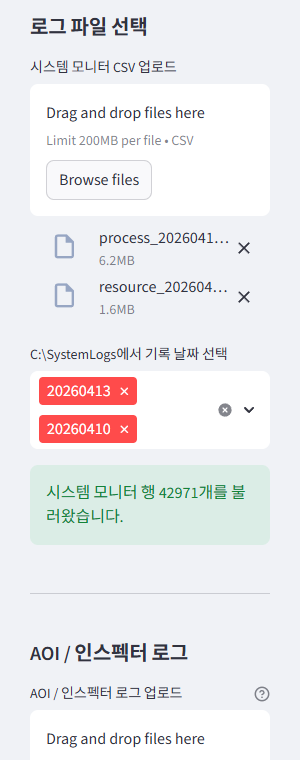

1. 블랙박스 QA 기준으로는 먼저 시스템 CSV를 읽어야 CPU, 메모리, 스토리지, 사용자 정의 그래프가 정상적으로 채워집니다.
2. `Browse files`로 `resource_*.csv`, `process_*.csv`를 직접 올리거나, 아래 날짜 선택에서 이미 저장된 로그 묶음을 고를 수 있습니다.
3. 초록색 `시스템 모니터 행 ...개를 불러왔습니다.` 메시지가 보이면 시스템 로그 로딩은 정상입니다.
4. 화면 예시의 파일명과 행 수는 샘플 데이터 기준이며, 실제 장비에 따라 다를 수 있습니다.

지원 입력 형식:

- `YYYY-MM-DD HH:MM:SS`
- `YYYY-MM-DD HH:MM`
- `YYYY-MM-DD`
- `HH:MM`
- `HH:MM:SS`

수동 필터 동작 규칙:

- `시작 시간`만 입력하면 입력 시각부터 로그 끝까지 표시합니다.
- `종료 시간`만 입력하면 로그 시작부터 입력 시각까지 표시합니다.
- `시작 시간`과 `종료 시간`을 모두 입력하면 해당 범위만 표시합니다.
- 입력한 시각과 정확히 일치하는 샘플이 없으면 `시작 시간`은 그 이후 첫 샘플, `종료 시간`은 그 이전 마지막 샘플로 자동 보정합니다.
- 여러 날짜를 함께 불러온 상태에서 시간만 입력하면 `시작 시간`은 첫 로드 날짜, `종료 시간`은 마지막 로드 날짜를 기준으로 해석합니다. 여러 날짜를 좁게 지정하려면 전체 날짜와 시간을 함께 입력합니다.
- `시작 시간`과 `종료 시간`을 모두 비우면 다시 슬라이더 기준으로 동작합니다.

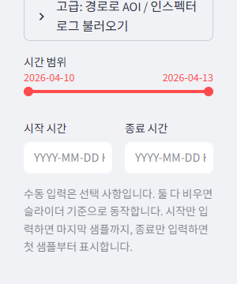

1. `시간 범위` 슬라이더는 큰 범위를 빠르게 줄일 때 먼저 사용합니다.
2. `시작 시간`, `종료 시간`은 초 단위까지 직접 입력해 더 좁게 필터링할 때 사용합니다.
3. 둘 다 비우면 다시 슬라이더 기준으로 돌아가고, 한쪽만 넣으면 반대쪽 끝은 자동으로 보완됩니다.
4. 현재 시간 필터는 상단 시스템 성능 요약, AOI 미리보기, 차트, XLSX 다운로드에도 같이 적용됩니다.

### AOI / SPI / 인스펙터 로그

- `AOI / SPI / 인스펙터 로그 업로드`에서 `Browse files`를 눌러 TXT, LOG, CSV 파일을 직접 선택할 수 있습니다.
- SPI 장비 로그는 `Log.CSV`와 날짜별 `ProcessResource_YYYYMMDD.log`를 함께 선택합니다.
- SPI `Log.CSV`는 `++++++++++++++++++++++++++++++++++++++++++++++++++` 구분자 기준으로 검사 블록을 나누고, `검사 종료 [ 경과 시간 : ... 초 ]`를 `Total`, `프레임당 검사 시간 : ... 초/프레임 ( ... 초 / ... 프레임 )`를 `Frame`과 프레임 수로 표시합니다.
- SPI `ProcessResource_YYYYMMDD.log`의 `[WorkingSet]=... KB` 값은 `메모리 (인스펙터)`로 표시되며, 각 SPI 검사 종료 시각 이전의 가장 가까운 ProcessResource 샘플과 매칭됩니다.
- 업로드 한도는 1GB입니다. 장시간 운전 로그도 UI 업로드 경로로 바로 확인할 수 있습니다.
- 개발자가 아닌 블랙박스 테스터도 파일 탐색기에서 바로 선택해 사용할 수 있습니다.
- 원본 TXT / LOG는 수정하지 않고, 필요한 `Model Open`, `InspTime`, `Working Set Memory Size` 라인만 읽어 별도 시계열과 검사 결과 표로 정리합니다.
- 큰 단일 로그는 내부적으로 여러 청크로 나눠 병렬 파싱하고, 여러 로그를 함께 올리면 파일 단위 병렬 파싱을 사용합니다.
- 앱은 사이드바를 렌더링할 때 기본 경로 `C:\Inspector\shared\operation.txt`를 먼저 자동 확인합니다.
- 기본 경로 파일이 있으면 사용자가 업로드한 것과 같은 방식으로 자동 업로드 처리하고, 없으면 경고 없이 조용히 대기합니다.
- `인스팩터 로그 다른 이름으로 저장` 버튼은 현재 불러온 원본 TXT / LOG를 그대로 다시 저장합니다.
- 한 파일만 불러왔으면 원본 파일명 그대로 저장하고, 여러 파일을 불러왔으면 ZIP으로 묶어 저장합니다.

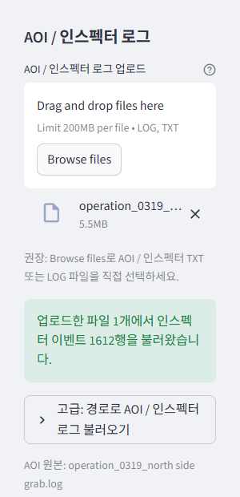

1. 왼쪽 사이드바를 아래로 내려 `AOI / SPI / 인스펙터 로그` 구역을 찾습니다.
2. 먼저 기본 경로 `C:\Inspector\shared\operation.txt`가 있으면 자동 업로드되어 바로 반영됩니다.
3. 자동 로드가 안 되었으면 `Browse files`를 눌러 TXT 또는 LOG 파일을 직접 선택합니다.
4. 파일명과 초록색 불러오기 성공 메시지가 보이면 로드는 정상 완료된 상태입니다.
5. 현재 불러온 원본 파일을 다른 위치에 보관하려면 `인스팩터 로그 다른 이름으로 저장` 버튼을 눌러 저장합니다.

### 검사 결과 XLSX 내보내기

- 선택한 대시보드 화면 아래쪽의 `검사 결과 XLSX 내보내기` 영역에서 AOI 검사 결과를 `NO=1`부터 순서대로 확인할 수 있습니다.
- `모델명`, `총 검사 수`, `시스템 메모리 매칭` 요약을 먼저 보여줍니다.
- `시작 NO`, `종료 NO`를 지정하면 해당 구간만 미리보기와 XLSX 다운로드에 반영됩니다.
- 이 내보내기 영역은 현재 대시보드 `시간 범위` 필터를 그대로 따릅니다.
- 시간 필터가 바뀌면 `시작 NO`, `종료 NO`는 새 필터에 포함된 전체 검사 범위로 다시 맞춰지고, 같은 필터 안에서 사용자가 직접 줄인 범위만 유지됩니다.
- 다만 `NO` 값 자체는 시간 필터 후 다시 매기지 않고, 원본 AOI/SPI 로그 기준 번호를 그대로 유지합니다.
- `메모리 (시스템)` 값은 해당 검사 시각보다 바로 이전인 시스템 모니터 `Mem_Used(GB)` 샘플을 사용합니다.
- `메모리 (인스펙터)` 값은 AOI 로그의 최신 `Working Set Memory Size` 또는 SPI `ProcessResource`의 최신 `[WorkingSet]` 값을 사용합니다.
- 직전 시스템 샘플이 없으면 `메모리 (시스템)`은 비어 있을 수 있습니다.
- `그래프 형식`에서 `선 + 마커`, `영역`, `막대`, `점` 중 원하는 미리보기 형식을 선택할 수 있습니다.
- `Frame`, `Total`, `메모리 (시스템)`, `메모리 (인스펙터)` 항목별 색상을 이름 기반 팔레트에서 직접 고를 수 있습니다.
- 색상은 HEX 입력 없이 직관적인 이름 기반 팔레트로 선택하며, 표 강조 색상도 같은 방식으로 바꿀 수 있습니다.
- `그래프 투명도`, `표 강조 투명도`를 바꿔 미리보기 표현을 조정할 수 있습니다.
- `미리보기 표`는 `NO`, `Frame`, `Total`, `메모리 (시스템)`, `메모리 (인스펙터)`를 표시합니다.
- `미리보기 그래프 항목`에서 `Frame`, `Total`, `메모리 (시스템)`, `메모리 (인스펙터)` 중 필요한 항목만 골라 비교할 수 있습니다.
- `XLSX에 인스펙터 메모리 포함` 옵션은 기본 `OFF`이며, 켜면 `메모리 (시스템)` 오른쪽에 `메모리 (인스펙터)` 컬럼이 추가됩니다.
- 다운로드되는 XLSX는 기본 `Inspection_Results` 시트 외에 `Inspection_12h_Samples` 시트를 함께 포함합니다.
- `Inspection_12h_Samples` 시트는 현재 시간 필터 시작 시각을 기준으로 `+0h, +12h, +24h ... +144h` 블록을 만들고, 각 기준점 이후 현재 시간 필터 종료 시각 이내의 첫 10개 검사 결과를 적습니다.
- 각 12시간 블록에는 `Timestamp`, `NO`, `Frame`, `Total`, `메모리 (시스템)`이 들어가며, 옵션이 켜져 있으면 `메모리 (인스펙터)`도 포함됩니다.
- 기준점 이후 데이터가 없으면 마지막 데이터 시각 기준 안내 문구를 적고, 시간 필터 범위 전체에 데이터가 없으면 `데이터가 존재하지 않습니다`로 표시합니다.

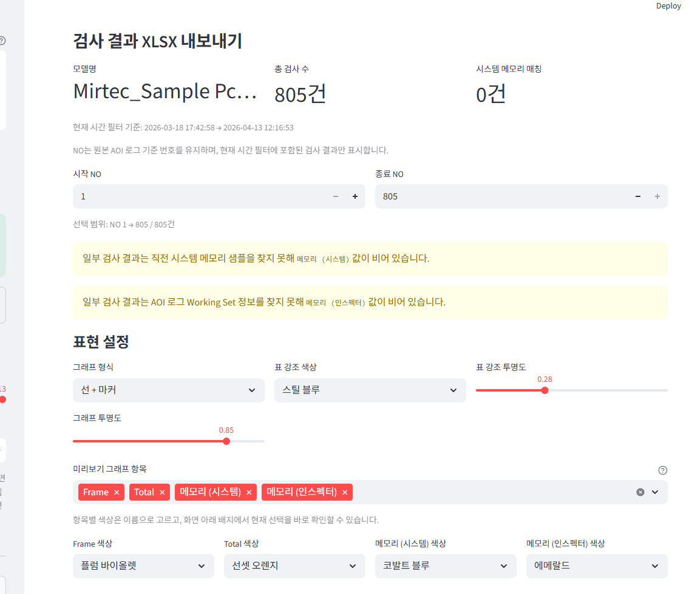

1. AOI/SPI 로그를 불러오면 대시보드 아래에 `검사 결과 XLSX 내보내기` 패널이 생깁니다.
2. 상단에서 `모델명`, `총 검사 수`, `시스템 메모리 매칭`을 먼저 확인합니다.
3. `시작 NO`, `종료 NO`는 현재 시간 필터에 포함된 검사 결과 범위 안에서만 선택됩니다.
4. `그래프 형식`, `색상`, `투명도`는 미리보기 그래프와 표 강조에 바로 반영됩니다.

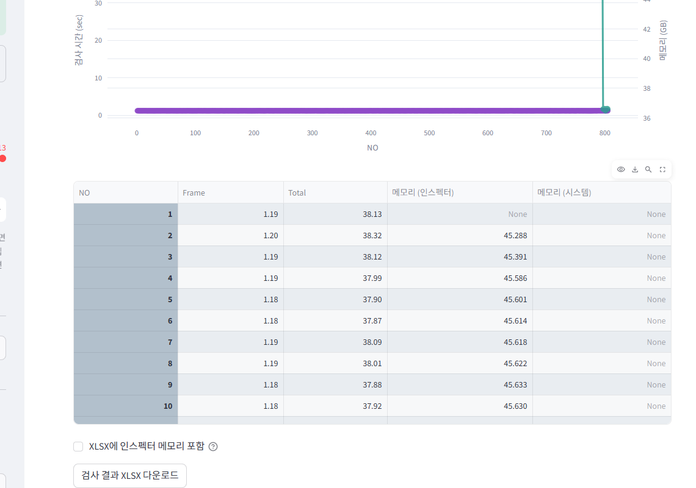

1. 패널 아래쪽에서 미리보기 그래프와 표를 함께 확인할 수 있습니다.
2. `XLSX에 인스펙터 메모리 포함`을 켜면 다운로드 파일에 `메모리 (인스펙터)` 컬럼이 추가됩니다.
3. 마지막 `검사 결과 XLSX 다운로드` 버튼이 실제 저장 버튼입니다.

## 대시보드 화면

- `CPU 대시보드`
- `메모리 + 인스펙터 대시보드`
- `스토리지 대시보드`
- `사용자 정의 그래프`

시스템 로그가 로드되면 대시보드 선택 전에 `시스템 성능 요약` 카드가 먼저 표시됩니다. 이 영역은 현재 표시 중인 시스템 로그 범위 기준으로 `CPU 사용량 평균/최고`, `CPU 온도 평균/최고`, `RAM 사용량 평균/최대`를 퍼센트 또는 섭씨 단위로 보여주며, 인스펙터 로그가 없어도 시스템 로그만 있으면 표시됩니다. 시간 필터를 바꾸면 이 카드도 필터된 구간만 기준으로 다시 계산됩니다.

그래프 오른쪽 상단 도구 모음에서 확대, 이동, 리셋, 이미지 저장을 사용할 수 있습니다.

1. 그래프 위에 마우스를 올리면 오른쪽 위 도구 모음이 나타납니다.
2. 확대, 축소, 이동, 초기화, PNG 저장을 여기서 바로 실행할 수 있습니다.
3. 보고용 스크린샷이 필요할 때는 그래프를 원하는 범위로 맞춘 뒤 저장 아이콘을 사용하면 편합니다.

## 각 대시보드에서 볼 수 있는 내용

### CPU 대시보드

- CPU 평균/피크 사용률
- CPU 온도 시계열
- CPU 온도 전용 대시보드
- 최대/평균 CPU 요약 지표
- `CPU 온도`는 1초마다 수집한 센서 값 중 각 5초 구간의 최고값을 사용합니다.
- Dell 대상 장비에서는 DCM `DCIM_NumericSensor`가 준비되면 이를 공식 우선 경로로 사용합니다.
- 일반 PC에서는 별도 워커가 LibreHardwareMonitor `Temperature` 센서 중 `CPU Core #n`만 대상으로 최고값을 읽고, EXE 동봉 번들이 없거나 워커 실패 시 OpenHardwareMonitor 뒤에 `PerfRawThermalZone` 경로도 시도합니다.
- 포터블 EXE 배포본에서는 `lhm-bundle/LibreHardwareMonitorLib.dll`과 `pawnio-bundle/PawnIO_setup.exe`가 함께 포함되므로, 현장 PC에서 인터넷이나 GitHub 인증서 없이도 일반 PC CPU 코어 온도 경로와 PawnIO 설치 경로를 바로 사용할 수 있습니다.
- 일반 PC CPU 코어 최고온도 워커는 30초마다 새 값을 갱신하고, 차트에는 각 5초 구간에서 마지막으로 알려진 코어 최고온도가 반영됩니다.
- 현장 디버깅이 필요하면 앱 하단 CPU 온도 테스트 버튼을 먼저 실행해 `cpu_temp_diagnostic_*.log`를 수집한 뒤, `Source`, `Sensor`, `worker_state_after`, `provider_diagnostics`를 확인합니다.
- 온도값이 계속 비어 있으면 `install_pawnio.bat` 또는 `SystemResourceMonitor*.exe install-pawnio`로 PawnIO 설치를 먼저 확인합니다. `install-pawnio --check-only`는 미설치 상태에서 `pawnio-bundle/PawnIO_setup.exe` 위치도 함께 안내합니다. 이후 LibreHardwareMonitor 공식 릴리스의 `LibreHardwareMonitor.exe`를 해당 PC에서 직접 실행해 CPU Core 센서가 노출되는지 확인합니다. 실행 자체가 실패하면 Microsoft .NET / .NET Core Desktop Runtime과 LibreHardwareMonitor 동봉 DLL 의존성 파일이 빠졌을 가능성이 높습니다.
- PerfRaw / Thermal Zone 에서 `_Total` 집계 레코드와 개별 zone 이 함께 보이면 개별 zone 을 우선하고, 그 안에서 가장 높은 유효 온도를 선택합니다.
- 일부 Dell 장비에서는 DCM `UnitModifier`가 실제 온도 스케일과 다르게 보일 수 있어, 프로그램은 비현실적으로 낮은 온도를 피하도록 직접 읽기값을 우선 해석합니다.
- Dell Command Monitor 또는 하드웨어 모니터 도구에서 `CPU Package` 센서가 보이면 해당 값을 메인 온도 지표로 우선 사용합니다.

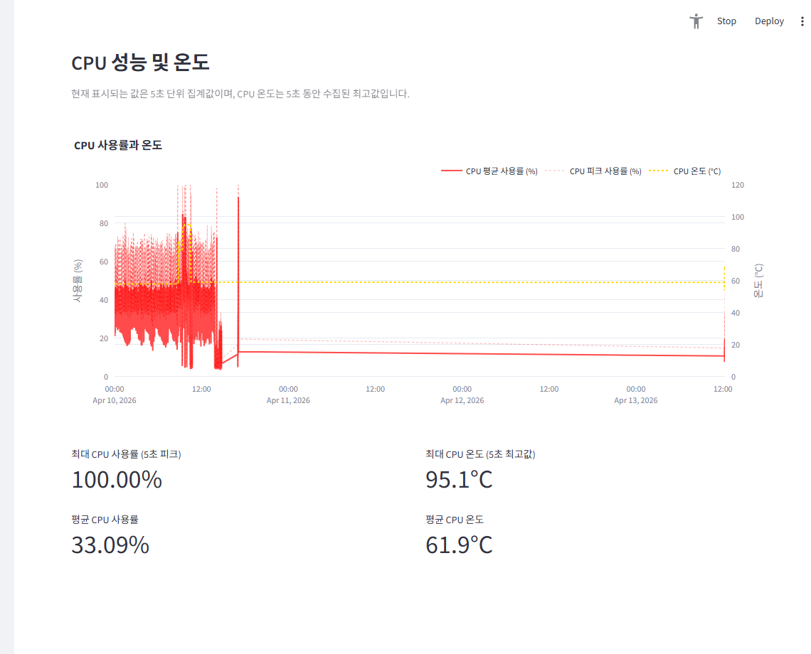

1. `대시보드 보기 선택`에서 `CPU 대시보드`를 고르면 CPU 화면으로 전환됩니다.
2. 첫 그래프 `CPU 사용률과 온도`에서 사용률과 온도를 같은 시간축으로 비교합니다.
3. 화면 아래 KPI 카드에서 최대 사용률, 평균 사용률, 최대 온도, 평균 온도를 빠르게 확인합니다.

### 메모리 + 인스펙터 대시보드

- 메모리 사용량과 스왑 사용량
- 현재 페이지 파일 사용량, 스왑 사용률, 가상 메모리 상태
- 상위 메모리 프로세스
- `인스펙터 앱 (로그)` Working Set 메모리 비교
- 외부 시스템 모니터 메모리와 AOI/SPI 로그 메모리 비교
- Inspector `Frame`, `Total`, `Working Set` 상세 시계열은 화면 아래 `검사 결과 XLSX 내보내기` 패널에서 확인
- 짙은 파란 선: 5초 평균 기준 실물 메모리 사용률
- 옅은 파란 영역: 같은 실물 메모리 사용률을 면적으로 강조한 표시
- 주황색 선: 디스크 스왑(페이지 파일) 사용률. RAM에 있던 일부 메모리가 디스크로 이동한 비율
- `가상 메모리 상태`가 `스왑 없음`이면 현재 스왑된 메모리가 없다는 뜻입니다.
- `가상 메모리 상태`가 `스왑 사용 중`이면 페이지 파일을 실제로 사용 중인 상태이므로 메모리 압박 여부를 함께 확인합니다.
- 페이지 파일 크기가 0GB로 기록되면 `페이지 파일 꺼짐`으로 표시합니다.
- 스왑 사용률이 1%를 넘는 구간이 있으면 메모리 그래프에 `스왑 시작` 점선과 붉은 배경 강조가 표시됩니다.

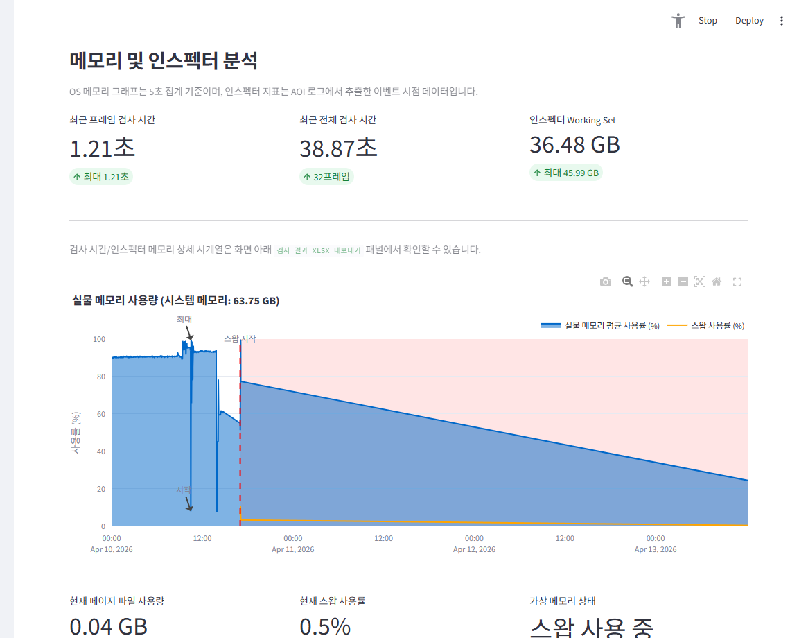

1. `메모리 + 인스펙터 대시보드`는 OS 메모리와 AOI/SPI 로그 메모리를 함께 보는 화면입니다.
2. 상단 카드에서 최근 프레임 검사 시간, 최근 전체 검사 시간, 인스펙터 Working Set을 먼저 확인합니다.
3. 메인 차트에서는 실물 메모리 사용량, 스왑 시작 시점, 스왑 사용률을 같이 봅니다.
4. AOI 상세 시계열과 XLSX 내보내기는 화면 아래 `검사 결과 XLSX 내보내기` 패널로 이어집니다.

### 스토리지 대시보드

- 디스크 활성 시간
- 디스크 읽기/쓰기 처리량
- 상위 디스크 I/O 프로세스
- 차트 품질 선택: `빠름`, `균형`, `상세`, `원본 (느림)`

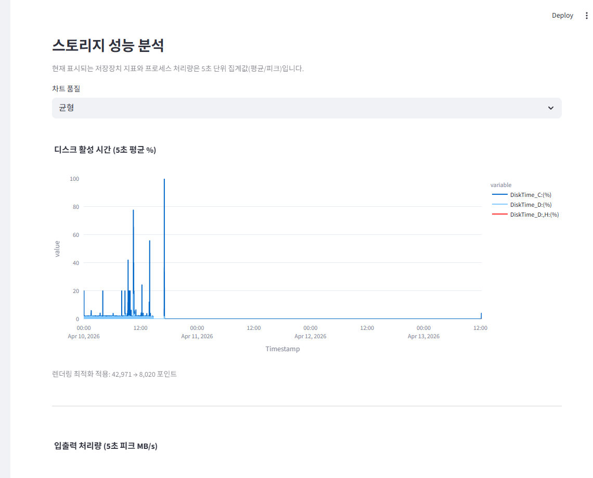

1. `스토리지 대시보드`에서는 저장장치 사용률과 처리량을 봅니다.
2. `차트 품질`은 기본적으로 `균형` 또는 `빠름`부터 확인하는 것이 안전합니다.
3. 첫 그래프 `디스크 활성 시간`으로 특정 드라이브가 바쁜 시점을 먼저 찾고, 아래 그래프에서 읽기/쓰기 처리량과 상위 프로세스를 이어서 확인합니다.

### 사용자 정의 그래프

- 원하는 지표를 직접 선택해 시계열 시각화
- 엑셀 내보내기 시작 시각 선택
- 상위 메모리 / 디스크 I/O 프로세스 막대 그래프

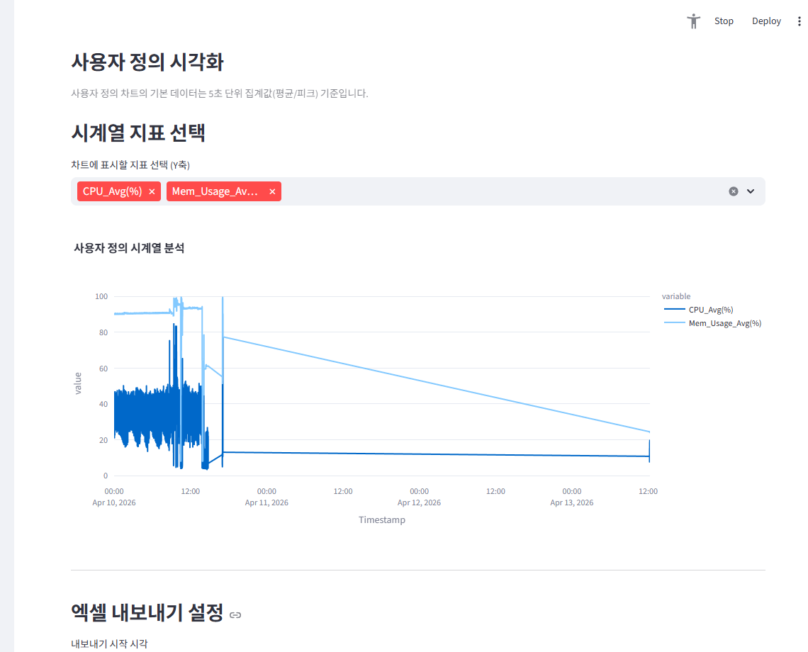

1. `사용자 정의 그래프`는 원하는 숫자 지표를 직접 골라 비교하는 화면입니다.
2. `시계열 지표 선택`에서 여러 항목을 고르면 같은 시간축 위에서 같이 그려집니다.
3. 아래 `엑셀 내보내기 설정`에서 시작 시각을 정한 뒤 현재 선택 지표만 별도 XLSX로 저장할 수 있습니다.

## 데이터 내보내기

- `병합 CSV 다운로드`: 시스템 모니터 병합 CSV 저장
- `파싱된 AOI/SPI 로그 CSV 다운로드`: AOI / SPI / 인스펙터 로그 파싱 결과 저장
- `인스팩터 로그 다른 이름으로 저장`: 현재 불러온 원본 TXT / LOG를 그대로 다시 저장. 여러 파일이면 ZIP으로 저장
- `엑셀(.xlsx) 다운로드`: 사용자 정의 그래프 선택 지표를 엑셀로 저장
- `검사 결과 XLSX 다운로드`: 기본적으로 `NO`, `Frame`, `Total`, `메모리 (시스템)` 컬럼으로 저장하고, 옵션을 켜면 `메모리 (인스펙터)`를 오른쪽에 추가합니다. 추가 시트 `Inspection_12h_Samples`도 함께 생성됩니다.

## 문제 해결

### 로그가 보이지 않을 때

- `C:\SystemLogs`가 존재하는지 확인합니다.
- 관리자 권한으로 수집기를 실행했는지 확인합니다.
- `로그 새로고침`으로 캐시를 비웁니다.
- AOI/SPI 로그는 `AOI / SPI / 인스펙터 로그 업로드`에서 파일을 다시 선택합니다.

### 그래프가 예상과 다를 때

- `시간 범위` 슬라이더를 확인합니다.
- 수동 입력이 남아 있으면 `시작 시간`, `종료 시간`을 비워 슬라이더 제어로 되돌립니다.
- AOI 검사 결과 XLSX와 미리보기는 현재 `시간 범위`를 그대로 따르므로, 기대한 데이터가 보이지 않으면 필터 시작/종료 시각을 먼저 확인합니다.
- 스토리지 화면에서는 `빠름` 또는 `균형`을 먼저 사용합니다.

### 메뉴얼 페이지가 열리지 않을 때

- 대시보드의 `매뉴얼 열기 (MkDocs)` 버튼을 사용하면 패키징된 `site/index.html`이 열립니다.
