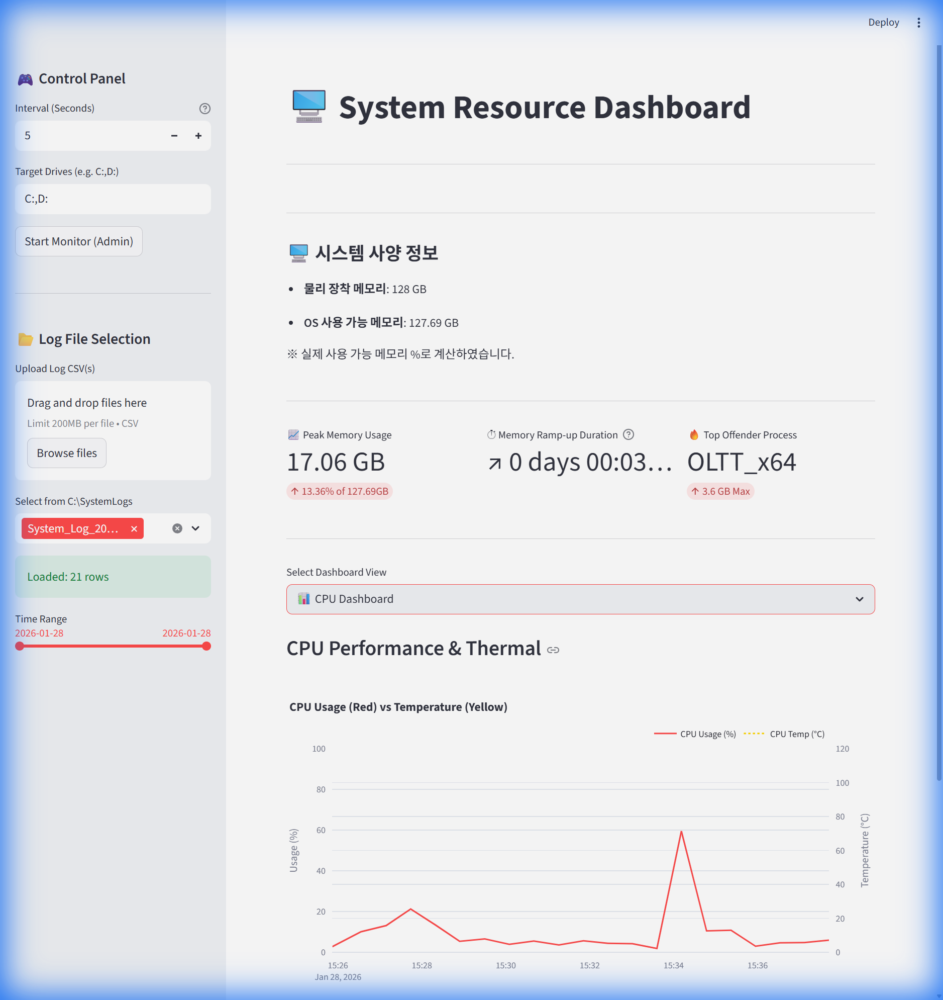

# 시스템 리소스 모니터 사용자 매뉴얼

이 문서는 실행 파일 또는 Streamlit 앱으로 제공되는 `System Resource Monitor`를 사용자 관점에서 설명하는 **단일 매뉴얼**입니다.  
빌드된 `site/index.html`만 열어도 사용 방법을 확인할 수 있도록 구성했습니다.

## 1. 프로그램 실행

1. 프로그램을 실행합니다.
2. 모니터링을 시작하려면 왼쪽 패널에서 수집 간격을 설정합니다.
3. `Start Monitor (Admin)` 버튼을 눌러 수집을 시작합니다.

- 로그 저장 위치: `C:\SystemLogs`
- 주요 로그 파일:
  - `Global_Usage_*.csv` (고주기 시스템 지표)
  - `System_Log_*.csv` (프로세스 Top5 요약)

## 2. 화면 구성

### 2.1 Control Panel

왼쪽 사이드바에서 다음 항목을 설정합니다.

- `Global Interval (s)`: 시스템 지표 수집 주기
- `Process Interval (s)`: 프로세스 Top5 수집 주기
- `Target Drives`: 스토리지 모니터링 대상 드라이브
- `Start Monitor (Admin)`: 관리자 권한으로 수집 시작
- `Stop Monitor (Logman Only)`: Logman 세션 중지

### 2.2 Log File Selection

- `Upload Log CSV(s)`: 직접 CSV 업로드
- `Select from C:\SystemLogs`: 로컬 저장 로그 선택
- `Time Range`: 선택 구간만 분석

## 3. 대시보드 선택 및 공통 조작

상단 `Select Dashboard View`에서 원하는 화면을 선택합니다.

- CPU Dashboard
- Memory Dashboard
- Storage (D:)
- Custom Graph

그래프 우측 상단 툴바에서 확대/축소/이동/리셋/이미지 저장이 가능합니다.

## 4. Storage 대시보드 사용법

Storage 화면은 대용량 로그에서도 동작하도록 차트 품질 옵션을 제공합니다.

- `Fast`: 가장 빠름, 요약 확인용
- `Balanced`(기본): 속도와 형태 보존 균형
- `Detailed`: 형태 확인 강화
- `Original (slow)`: 원본 포인트 그대로 표시(대용량에서는 느림)

권장 순서:

1. 먼저 `Balanced`로 전체 추세 확인
2. 이상 구간이 있으면 `Detailed`로 확대 분석
3. 최종 검증이 필요할 때만 `Original (slow)` 사용

## 5. CPU/Memory 대시보드

### 5.1 CPU Dashboard

- CPU 사용률 추이
- (수집 시) CPU 온도 추이
- 최대/평균 CPU 사용률 지표

### 5.2 Memory Dashboard

- 메모리 사용률/스왑 추이
- 메모리 Top 프로세스
- 프로세스별 메모리 시계열

## 6. Custom Graph + 엑셀 내보내기

1. `Custom Graph`에서 시각화할 지표를 선택합니다.
2. `Export Start Time`을 선택합니다.
3. `Download as Excel (.xlsx)` 버튼으로 내보냅니다.

## 7. 문제 해결

### 7.1 로그가 보이지 않을 때

- `C:\SystemLogs` 폴더가 생성되었는지 확인
- `Start Monitor (Admin)`를 관리자 권한으로 실행했는지 확인

### 7.2 그래프가 비정상적으로 느릴 때

- Storage 화면 `Chart Quality`를 `Fast` 또는 `Balanced`로 변경
- `Time Range`를 좁혀서 다시 확인

### 7.3 데이터가 비어 보일 때

- 로그 파일 선택이 올바른지 확인
- 로그 수집 시작 시각과 분석 시각이 일치하는지 확인
